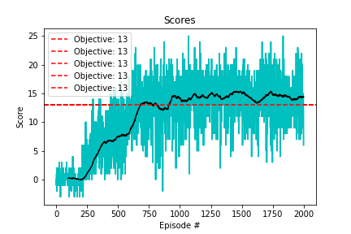

# Report for Project 1: Navigation
Author: Quentin Cangelosi, <cangelosi.quentin@gmail.com>

This report details the methods, algorithms, results and learnings from working on the Navigation project, as part of the Udacity Nanodegree Deep Reinforcement Learning. 

Demonstration of a trained agent (simple Deep Q-Learning with Network Structure composed of fully connected layers of sizes: inputs=37 > 20 > 15 > 8 > output=4).

## Code
The code to solve the project is spread over 4 scripts:
    
    examples/navigation/Navigation.ipynb and examples/navigation/Navigation.py (Navigation.ipynb is copied from it)
        Initiate the Unity Environment, take some inputs about network architecture and algorithm options/extensions,  initiate the Agent and the Monitor, train and test the agent.
        
    rl_library.monitors.unity_monitor.py
        Monitor interactions between environment and agent.
        
    rl_library.agents.dqn_agent.py
        DQN Agent class
        
    

## Methods and Algorithms

### Reusability, the RL-Library Idea
My first objective for this project was to reuse the Deep Q-Learning code written during the coding exercises to solve the Lunar Lander problem of openAI Gym.
By *reusing* is meant here to actually avoid simply copy/pasting the code and only adapt the few required adjustments, but rather to consolidate the code into a framework that
could run for both problems and be flexible enough to solve any additional problem. Yet, I'm fully aware that the code might not be completely ready to take up this challenge,
simply because I did not actually solve multiple projects yet. The first steps in that direction should have been already walked though.

As part of this flexibility, I first implemented the possibility to provide the network architecture as an argument, either by providing directly a model to the DQAgent class or a list of hidden layer sizes, from which a fully connected network would be built using Relu activation and ending with a softmax activation. 
When experimenting with the Navigation project, I solely used the list of hidden layers sizes, having a script where I could simply change this input and that would
train an agent and saved the results in a folder automatically named with the sizes of the hidden layer sizes (`save_path` in Navigation.py/.ipynb).
As mentioned in the README.md, I worked only with python scripts (with Navigation.py as entrypoint) and later rebuilt Navigation.ipynb from Navigation.py in order to 
allow my work to be reviewed with shown outputs.

For this project, I use a DQAgent class in the `rl_library.agents.dqn_agent.py` script which contains all the methods required by the agent: init, step, act, learn, soft_update. To which I added methods to save and load the agent from a file, preprocess the state (to be overwritten with functions, for example of image preprocessing in the case of image states (pixel problem)). This is heavily based on the class provided during the coding exercices.

Handling of the agent in Unity environments is done in `rl_library.monitors.unity_monitor.py`, also baseed on provided code in the exercices.

### Experimenting different network architecture
Once the DQAgent was able to take as input different network architecture sizes, I ran different experiments to see what kind of architecture seemed to work best. Here is the short list of configurations tried, whose performance can be seen in the Figure 2:
    
    - 2 Hidden layers with sizes 18 and 18 (named nn_18_18 on Figure 2)
    - 2 Hidden layers with sizes 18 and 9 (named nn_18_9 on Figure 2)
    - 3 Hidden layers with sizes 20, 15 and 8 (named nn_20_15_8 on Figure 2)
    
It was more an intuitive experimenting than any scientific study, but I had the impression that a funneling architecture over 3 hidden layers was working good enough, achieving already the performance objective of an average score of 13 (rolling window of 100 episodes) after 1800 episodes. My objective here being to study deep reinforcement learning and its various algorithms/improvements, I stopped there with hyper-parameter tuning and decided to continue by implementing the DQN improvements mentioned in the lessons.

### Implementing Double Q-Learning
Double DQN improves the original DQN algorithm by choosing the best action from one network (the local network) and evaluating 
it's action value with a different network (the target network). As such, it prevents "overfitting" to a specific action
early on during the training, as both local and target networks have to agree that this is a good action.

Implementing this improvement only requires to change which network is selecting the best action and which network 
evaluates the value of these actions. A flag `use_double_q_learning` was therefore introduced in the DQNAgent class, 
which will only affect this specific part of the `learn` method. This flag is activated by providing an argument `options`
to the class constructor, intended to receive a list of the options, or improvements, that should be used in the class. 
The specific argument for activating the double Q Learning being `options=['double-q-learning']`. My objective here from 
the beginning was to end up with a list of options that would correspond to the Rainbow model.

The results of this improvement were significant on the performance, as can be seen on the comparison figure Figure 2 in 
the Results section. With all other parameters and network architecture equal, the improvement of double Q learning – red 
vs. green curves – is  significant both in terms of number of episodes to solve the environment (score of 13) as well as 
final performance (around 15 for double q learning, 13 for simple DQN).

I then experimented with different parameters `UPDATE_EVERY` and `TAU` to try to reduce the number of episodes before 
convergence and the running time of the algorithm. Lower `TAU` (brown curve Figure 2), responsible for the soft update of target parameters, 
led to a slower convergence, with a performance still under 13 after 2000 episodes. Higher `TAU` (pink curve Figure 2)
seemed to not be beneficial, with lower final performance and longer number of episodes to the 13 performance score, 
although this could be simply a random effect and does not seem significant. A more thorough analysis could be done, 
varying the parameter over a wider range of values, and running multiple experiments (with different random seeds) for 
each set of parameter in order to reduce random initialization effects (recurrent problem in deep learning). 
 
    
### Implementing Prioritized Experience Replay
In its first implementation, DQN uses experience replay to select a sample of actions-state pairs to learn from. However,
some action-state pairs might contain less information to learn from than other which is why suggestions were made to 
prioritize them according their loss value between estimated value state from the neural network, and observed return (cf. [paper](https://arxiv.org/abs/1511.05952)). 
The greater the loss, the less the neural network is able to accurately evaluate the state-action pair, the more it can 
learn from such events (which could well be rare events, under-represented in the experience replay memory).  
 
The idea being clear, the implementation of this improvement appeared a bit more tricky. First, it requires to set a 
probability to each state-action pair proportional to its loss, meaning that the algorithm needs to evaluate with the 
neural network the pair and then compute a loss value. Then, during the learning step, the memory must be sampled using 
the computed probabilities. And finally the probabilities needs to be updated to reduce/increase the probability of pairs
from which the algorithm has learned from and avoid overfitting to them (if their probability would remain high, the neural 
network would keep learning from the same pairs and overfit them).

All this added complexity seemed to have a serious impact on the running time of the agent. I looked for other implementations
of prioritized replay and made some code optimization, timing specific implementation of some lines against other possible
implementations. I didn't reach a level that was satisfactory to me and was wondering if there is really a benefit of prioritizing 
the experience replay, knowing that what matters in the end is not only the performance or the number of episodes before
convergence, but the needed runtime to converge. In my case it seemed that not prioritizing the experience replay was 
leading to faster episodes, thus a faster convergence. However I did notice when looking at the smart agent in action 
that, although the average score of the agent is over the threshold, it could sometimes fall into specific states where it
would get stuck (for example surrounded by blue bananas and keeping looking "right-left-right-left" from one banana to the other).
These seem to me very specific cases, surely under-represented in the memory, and from which prioritization might have 
helped ensuring a better solution.

Using the same principle as for the double q learning improvement, I added the option `prioritized-replay` in the `options` argument of the `DQAgent` and the flag `use_prioritized_replay` inside the class. This improvement being larger in the code, I admit this could need some refactoring to keep the code tidy and clean, especially as additional improvements would get into play.

Acknowledging that this part requires longer time investment, as well as noting that in some of the implementations I 
could read online were based on slightly different concepts, which might be part of the third part of the nanodegree, I 
prefer to stop here for this project, adding this to the long list of further work.  

## Results Comparison

*Figure 2: Solutions Comparison*

As described in the Methods and Algorithms section, various implementation have been tested and compared. On the Figure 2 can be observed two different types of algorithm: the simple DQN algorithm (prefix "nn_" in legend) and the double-q-learning improvement (prefix "double_q_learning_" in legend). Both were tested with different parameters, first the architecture of the DQN algorithm was briefly optimized, as described section "Experimenting different network architecture". Then some hyper-parameters were compared within the double-q-learning, as described in section "Implementing Double Q-Learning". However the best result was obtained on the first try of double-q-learning, with the best architecture found when testing DQN and with the hyper-parameters set initially be the instructors (probably suggesting that already were well optimized, although the tuning effort on my side was relatively small).  

## Further Work

##### Prioritized Experience Replay

As described in the corresponding section, this was already implemented with mixed results that would require longer time investment, which is postpone to a later stage in the nanodegree.  

#####  Dueling DQN

This is an improvement that I also want to implement in the future, although I now see, after having started the second part of the nanodegree, that it could become obsolete as we move to policy based method. Thus I would also postpone this to a later stage and if not obsolete.

##### Rainbow

This was my initial goal in this project, which I would eventually like to get to as it seemed to outperform all separated improvements. First the postponed tasks above should be completed.

##### Unit Test

I set up myself to start a RL-Library that would be reusable and extendable, which means that it also needs to be thoroughly unit-tested. I also think of some integration tests which would consist of ensuring that the algorithms are still solving the most basic (because the test should be fast) RL problems (e.g. CartPole).

##### Pixel-based Navigation

Although optional at this point, the use of images inputs might come naturally along this course and as it requires more hyperparameter tuning and is longer to run, I would reserve this for a later stage, probably on one of the following project. My main objective here was to learn about the Reinforcement Learning algorithms and it is clear to me that they can later be enhanced by more advanced neural networks to process more complex input states. However, I imagine to come back to this problem as a good exercise to test the CNN/pixel-based solution against the current one. 

## Self-Evaluation against evaluation criteria of the report

#### Report
    The submission includes a file in the root of the GitHub repository or zip file 
    (one of Report.md, Report.ipynb, or Report.pdf) that provides a description of 
    the implementation.

Yes, this is the document being read.

#### Learning Algorithm
    The report clearly describes the learning algorithm, along with the chosen hyperparameters. 
    It also describes the model architectures for any neural networks.

Please read section Methods and Algorithms.

#### Plot of Rewards
    A plot of rewards per episode is included to illustrate that the agent is able to receive an average reward (over 100 episodes) of at least +13. The submission reports the number of episodes needed to solve the environment.

#### Ideas for Future Work
    The submission has concrete future ideas for improving the agent's performance.
        
Please read section Futher Work.