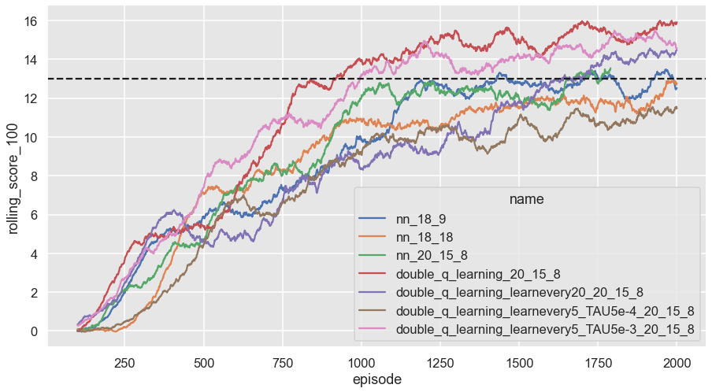

# Report for Project 1: Navigation
Author: Quentin Cangelosi, <cangelosi.quentin@gmail.com>

### On Prioritized Experience Replay 
I did implement as well the option of using prioritized experience replay, as described in the [paper](https://arxiv.org/abs/1511.05952).

Criteria 	Meets Specifications

Report
	

The submission includes a file in the root of the GitHub repository or zip file (one of Report.md, Report.ipynb, or Report.pdf) that provides a description of the implementation.

Learning Algorithm
	

The report clearly describes the learning algorithm, along with the chosen hyperparameters. It also describes the model architectures for any neural networks.

Plot of Rewards
	

A plot of rewards per episode is included to illustrate that the agent is able to receive an average reward (over 100 episodes) of at least +13. The submission reports the number of episodes needed to solve the environment.

Ideas for Future Work
	

The submission has concrete future ideas for improving the agent's performance.