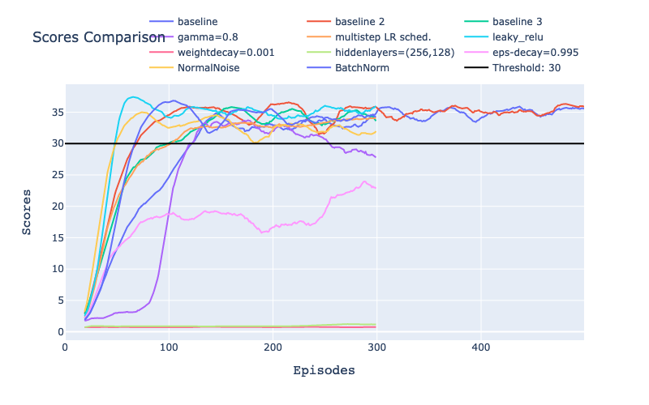
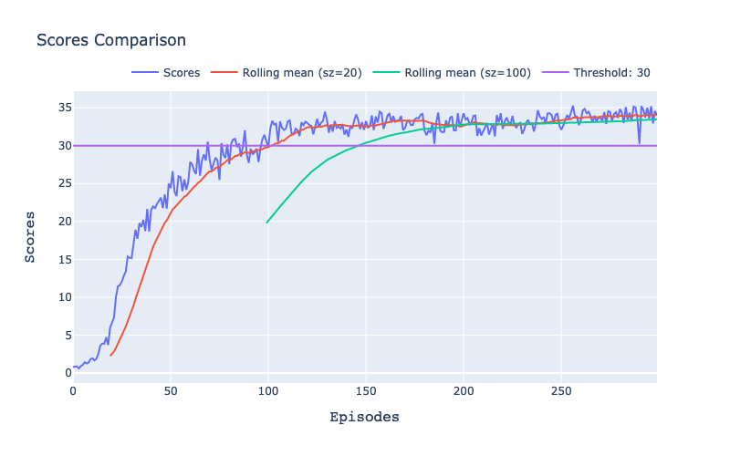

# Report for Project 2: Continuous Control
Author: Quentin Cangelosi, <cangelosi.quentin@gmail.com>

This report details the methods, algorithms, results and learnings from working on the Multi Agents Continuous Control project, as part of the Udacity Nanodegree Deep Reinforcement Learning. For more information on the environment please go to the README document [here](README.md)

## Source Code

As for the first project, the source code to solve this second project is wrapped up in the "rl_library", aiming at creating the foundation of generalisable, reusable and maintainable  Deep Reinforcement Learning algorithms. 

The entry-points to solve this project are the notebook and script `examples/p2_continuous-control/Continuous_Control(.py/.ipynb)`. The python script being the version used during development and the notebook being a replicate allowing reviewers to visualize the outputs.  

It is also possible to run the test script `examples/p2_continuous-control/Continuous_Control_test.py` to directly watch a trained agent over 10 episodes of the environment.

The DDPG agent is implemented under `rl_library/agents/ddpg_agent.py` and is based on the example provided in the nanodegree to solve the Bipedal-Walker environment. The pytorch models for the Actor and the Critic networks are instanciated from the scripts `rl_library/agents/models/heads.py` and `rl_library/agents/models/body.py`. Various utils used by the DDPG agent are located under `rl_library/utils` as the normalizers, replay buffer, noise classes and visualization methods.

## Methods and Algorithms

### Method

First, I started to work on the DDPG agent using the example of the Bipedal-Walker, which was not really solved with the code and hyper-parameters provided in the nanodegree. From there my first initiative was to move this code to the rl_library, improve the monitors already started and continue from there to improve the DDPG Agent. As recommended by the teacher Miguel Morales, I perused the [DeepRL](https://github.com/ShangtongZhang/DeepRL) repository from  ShangtongZhang. I found the general implementation of the neural networks into head and body classes very elegant and reused this concept. I also read the [DDPG paper](https://arxiv.org/abs/1509.02971) several times. Unfortunately, I spent enormous amount of time trying to solve the Bipedal-Walker-v3 and the single agent continuous-control Unity environment with not much success at first. I implemented different noise options to add to the actions or to the network weights, different batch and reward normalizations, added learning rate schedulers for the network optimizers and did a lot of hyperparameter tuning which I could analyse thanks to thorough book-keeping of every parameter into configuration JSON files. I also studied the implementation from openai in the [baselines](https://github.com/openai/baselines) repository. 

After several weeks into this process, I decided to review how others solved this continuous-control problem and could finally spot some mistakes I had made early on when splitting actor and critics neural networks into heads and bodies: the critic last layer was not a single value for Q(s, a) but had the same size as the actor last layer, one node per action. Then, after finally starting to print much more debugging outputs in the console, I could spot that I was reusing the ReplayBuffer from the previous project, which was refactoring actions into integers. Finally, in my effort to make the code flexible enough, I realised I had the critic network head doing an extra relu activation on the last Linear layer, making learning almost impossible. Interestingly, all this was not breaking anything nor leading to noticeable divergence. It was not a pleasant experience for sure but after understanding my mistake and looking back at all the work I had done to try improving the DDPG agent I have learned much deeper the algorithm details, its multiple implementations in github and its various tricks.  

Once I finally had one implementation successfully solving the multi-agent continuous problem, the method I followed was to gradually reactivate some of the improvements I had already implemented: compare different noises, evaluate the impact of batch normalization, of reward normalization, see if using learning rate schedulers accelerate learning or not, do some hyper parameters tuning to understand which ones have the greatest impact. Then I would like to solve the other environments, the single agent and the crawler and to compare this DDPG approach to other algorithms as A3C, A2C, PPO, TRPO or D4PG. However, because of the delay I got in this project, most of this will have to be stated as further work in this report.

### Algorithm

To solve this continuous-control problem, the Deep Deterministic Policy Gradient (DDPG) algorithm was used. Following its original [paper](https://arxiv.org/abs/1509.02971), two fully connected networks were used to learn the best actions (actor) given the current state and the state-value function Q(s, a) (critic) given the current state and taken action. Both actor and critic have a local and a target network which are constantly but "softly" synchronised by updating the target parameters with a fraction of the local parameters at every learning step. This proved to significantly stabilize training. Like in the paper, we use an Orstein-Uhlenbeck process to add noise to the taken actions and allow the agent to explore. Finally, as recommended in the DDPG paper, we use batch normalization and evaluate its impact on the training (from [Ioffe & Szegedy](https://arxiv.org/abs/1502.03167)).

For a detailed description of the algorithm and hyper-parameters used to solve this project, please refer to the Baseline part in the Results Comparison section.

## Results Comparison

In this section, we will describe the baseline agent and parameters used to solve this problem and then study the impact of changes in various parameters. One key enabler for this comparison is the aggregation of all these parameters into a configuration dictionary, which can then be saved and used to compare all experiments. Moreover, it is a functionality which greatly facilitates the generalization of the algorithms and methods to solve different environments with few code changes. 

### Baseline

The baseline for this comparison, which we demonstrate to solve the environment in the notebook `Continous_Control.ipynb`, is close to the baseline used in the DDPG paper. The actor network has 2 fully connected hidden layers of sizes 200 and 150, activated with RelU function and ending with a tanh function to predict the next agent actions which are 
continuous values bounded between -1 and 1. The critic network has 2 fully connected hidden layers of sizes 400 and 300, where the actions are inserted only from the second hidden layer. The network weights are initialized from a uniform distribution similar to the DDPG paper. The soft-update of the target networks is made with a rate `TAU` of `1e-3`. The learning rates of the actor and critic network are both `1e-3`. There is no weight decay applied to the networks. The agent is doing one step of learning for every step in the environment. An Orstein-Uhlenbeck process noise is added to the action at every step with parameter `sigma=0.2` and `theta=0.15`. The replay buffer size is `1e6`, the batch size is `128` and the discount factor is `0.99`.

Overall, this baseline is very close to the one used in the original DDPG paper, with some exceptions as the weight decay, the smaller hidden layers of the actor network, the larger learning rate for the actor and larger batch size. Also the batch normalization of the input states is not included in the baseline. 

All experiments are run over 300 episodes (with the exception of few initial experiments over 500 episodes).

### Comparison figure

In the following figure, we compare the baseline scores to various experiments which will be described below. All curves shown are rolling averages of the average score of the 20 agents with a rolling size of 20 episodes. There are figures named  "baseline", "baseline 2" and "baseline 3" which are repetitions of the baseline described above, shown to depict the variability from one run to another. Of course, a serious analysis would have required to run every experiment multiple times (e.g. 5) and show the average in order to reduce this variability and better compare actual performances impacts.

### Discount Factor
Intuitively, the actions taken at every timestep in this continuous-control problem seem to be equally important and have little impact in the far future rewards. Indeed, the agent is rewarded at every single timestep where it stays close to the ball. As such, there is no major need for propagating the rewards in a long time horizon and smaller discount factors should work well in this case.  As can be seen in the comparison figure, the curve "gamma=0.8" was able to reach an average score of 30 after around 120 episodes. with a much slower initial progress and a sudden jump around the 100th episode. This is probably due to the fact that propagating the reward less also reduces the ability to learn not from the current state and action only but from the following states as well. As good actions now have a higher chances to lead to good actions in the future, it actually speed learning to also consider the future rewards (high discount factor) as much as current reward (small discount factor). The experiment run with a discount factor of 0.8 also proved to not be stable, as scores started declining from the 200th episode onward, which would require more investigation to explain.

### Leaky-Relu
Changing the networks hidden layers activation from ReLU to leaky-ReLU, as done in one of the teacher example of this nanodegree, seemed to be one of the most important factor to speed up the training, as can be seen on the comparison figure with the curve named "leaky_relu". My intuition is that, by not clipping to 0 all negative input values but rather affecting a small negative value proportional to the value, more information is "kept" from which the optimizer can more rapidly learn. I'm still to research this topic further for actual proof.

### Epsilon Decay
In previous project and examples, we used an epsilon coefficient to balance exploration and exploitation, which was decay over the episodes to move from high-exploration/low-exploitation to low-exploration/high-exploitation and slowly let the agents converge to their optimal policy. In the DDPG paper however, a noise is applied to the actions to allow exploration but never decays in intensity/scale.    

### Weight Decay
Interestingly, setting the weight decay to `1e-3`, which is lower than the weight decay used in the DDPG paper of `1e-2`, led the baseline to diverge, suggesting that other parameters would probably require adjustments to counter act this L2 regularisation term. Hyper-parameter tuning of the DDPG Agent seems to me a sensitive task which require some more thinking to come to a generalizable set of parameters. This is something which seemed to be achieved in the DDPG paper. Maybe the batch normalization, missing in the baseline, plays an important role as its paper suggests.  The experiment with a weight-decay of `1e-3` is depicted in the comparison figure with the name "weightdecay=0.001".

### Network architecture
The network architecture used in the DDPG paper is rather large with 2 hidden layers of 400 and 300 nodes. Finding smaller architectures able to solve the environment would help speed up the training process (in computing time). This seemed however not to bear fruits for the different experiments tried, as can be seen in the comparison figure with name "hiddenlayers=(256,128)". It could however be that it is not that the smaller architecture would not be able to learn a successful policy (with scores above 30) but rather that the other hyper parameters also need adjustments to better work with different architecture sizes. 

### Learning rate scheduler
In deep learning, the learning rate is always an hyper parameter difficult to set and generalize. Too large, the network will never converge. Too small and the convergence might be too slow. To solve some of the issues linked to this dilemma, multiple strategies exists which try to dynamically update the learning rate during the training. In pytorch, there are multiple learning-rate schedulers available, and I experimented with 2 in this project: one exponentially decays the learning rate by a factor gamma at every step (not shown) and one decaying it after defined milestones. The milestones were set to halve the learning rate every 30 episodes, up to 6 times so that it then plateaus and do not get too small.

As can be seen in the comparison figure under the name "multistep LR sched." the impact on the training appears at the end of the training, after 100 episodes, where the scores fluctuate less than the baseline and thus are more stable thanks to the smaller learning rate. Training for more episodes would have maybe helped determining if the agent would have kept a steady upward trend and outreached the baseline in performance.  

### Action Noise
The baseline solution includes an Ornstein-Uhlenbeck process to add noise on the actions, as per the DDPG paper. This process is said to be specifically appropriate for physical-control problems with inertia, as is the case for this continuous-control environment. Compared to simply taking random number following a normal distribution, it introduces correlations between consecutive noise samples. It is indeed interesting to visualize on the Bipedal-Walker environment where we can see a significant difference with a pure normally distributed noise. To understand how much influence it has on the performance of the baseline, we compare it to an experiment run with a normally distributed noise of mean 0 and variance 1. The result is depicted in the comparison figure with the name "NormalNoise" and the impact on the performance seemed to be minor. The agent still solved the environment but the scores depicts a slight downward trend towards the end of the training, still remaining over the threshold of 30.   

### Batch Normalization

Batch normalization is often referred as one of the greatest improvement in the Deep learning community to improve stability and overall performance in most applications. It consists in rescaling the inputs of any network layer of each batch to be centered (mean=0) and with variance equals to 1. It is unclear to me if the DDPG paper used it at all input and hidden layers or only at the input layer. I applied it only to the input layers of both actor and critic network using the pytorch function "BatchNorm1d". The experiment is represented on the comparison figure under the name "BatchNorm" and led to slightly higher scores compared to the baselines which might not be so significant (further analysis required). 

## Further Work

As already mentioned in the Methods and Algorithms section, there were a lot of items I wanted to study, learn, implement and compare in the framework of this project that I have to state as further work, given that most of my time on that project has been spent integrating the DDPG agent into the rl-library and learning the hard way that generalization requires more careful testing. Below is a non-exhaustive list of further work on this type of problems.

1. Adaptive Parameter Noise: Instead of adding noise to the actions, [adding noise to the networks weights](https://openai.com/blog/better-exploration-with-parameter-noise/) has proved to boost performance
2. Adaptive Reward Normalization
3. Comparison with other algorithms (A3C, A2C, PPO, TRPO, D4PG)
4. Prioritized Replay buffer and its impact on number of episodes and elapsed time before solving the problem

## Self-Evaluation against evaluation criteria of the report

#### Report
    The submission includes a file in the root of the GitHub repository or zip file 
    (one of Report.md, Report.ipynb, or Report.pdf) that provides a description of 
    the implementation.

Yes, this is the document being read.

#### Learning Algorithm
    The report clearly describes the learning algorithm, along with the chosen hyperparameters. 
    It also describes the model architectures for any neural networks.

Please read section Methods and Algorithms.

#### Plot of Rewards
    A plot of rewards per episode is included to illustrate that the agent is able to receive an average reward (over 100 episodes) of at least +13. The submission reports the number of episodes needed to solve the environment.

#### Ideas for Future Work
    The submission has concrete future ideas for improving the agent's performance.
        
Please read section Futher Work.