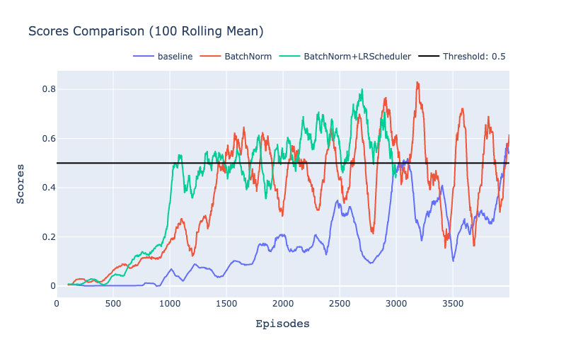
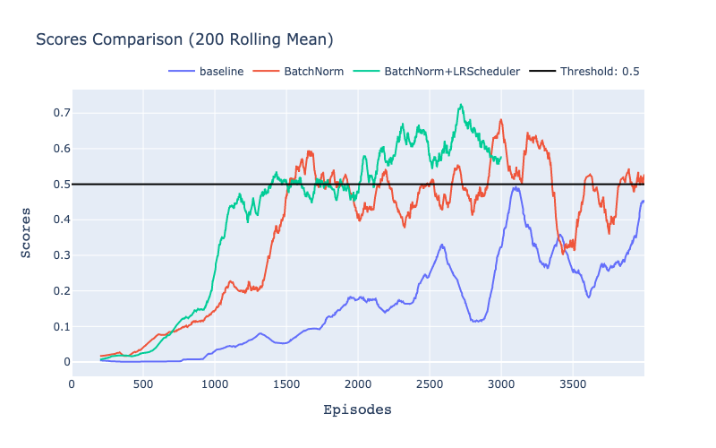
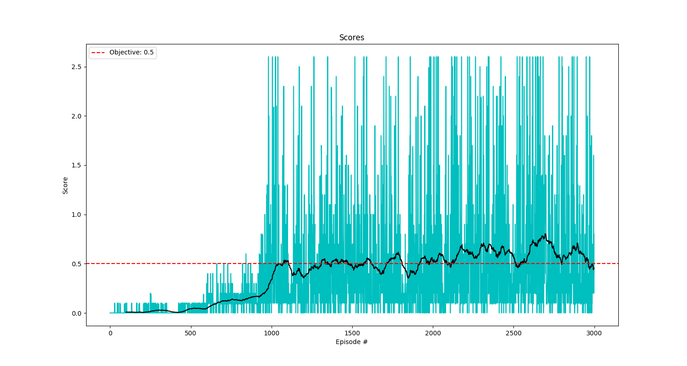
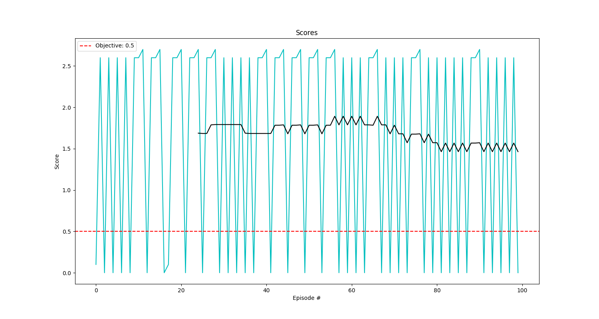

# Report for Project 3: Collaboration and Competition
Author: Quentin Cangelosi, <cangelosi.quentin@gmail.com>

This report details the methods, algorithms, results and learnings from working on the Multi Agents Continuous Control project, as part of the Udacity Nanodegree Deep Reinforcement Learning. For more information on the environment please go to the README document [here](README.md).

Figure 1: Agents trained with MADDPG during testing. Test scores are depicted on Figure 5. 

## Source Code

As for the other two projects, the source code to solve this second project is wrapped up in the RL Library hosted in this repository, aiming at creating the foundation of generalisable, reusable and maintainable Deep Reinforcement Learning algorithms. 

The entry-points to solve this project are the notebook and script `examples/p3_collab-compet/Tennis(.py/.ipynb)`. The python script being the version used during development and the notebook being a replicate allowing reviewers to visualize the outputs.  

It is also possible to run the test script `examples/p3_collab-compet/Tennis_test.py` to directly watch a trained agent over 100 episodes of the environment. Note that the agents here are **very** good at the game and you might want to reduce the number of episodes for testing. Test scores are depicted Figure 5 and averaged a reward of 1.6.

The MADDPG agent used to solve this project is implemented under `rl_library/agents/maddpg_agent.py` and is based on the original [paper](https://arxiv.org/abs/1706.02275v4). The DDPG agents are reused from the second project on Continuous Control and located at `rl_library/agents/ddpg_agent.py`. The pytorch models for the Actor and the Critic networks are instanciated from the scripts `rl_library/agents/models/heads.py` and `rl_library/agents/models/body.py`. Various utils used by the MADDPG and DDPG agents are located under `rl_library/utils` as the normalizers, replay buffer, noise classes and visualization methods.

## Methods and Algorithms

### Method

To solve the Tennis problem, where two agents are playing tennis and getting rewards by hitting the ball over the net, I decided to implement the Multi-Agent DDPG algorithm described in the [Ryan Lowe et al.](https://arxiv.org/abs/1706.02275v4) paper. Indeed the problem can be separated in two independent agents that have to collaborate to maximise their rewards, as both agents want to exchange the ball as much as possible during one episode. The agents have two continuous actions each, moving forward/backward and jumping. As such, the code implemented to solve the continuous control problem in the second project of the nanodegree can be heavily leveraged to solve the Tennis problem.  

Indeed, the code used to solve the continuous control project, based on the [DDPG paper](https://arxiv.org/abs/1509.02971), could also directly solve this project and achieve the target  score of 0.5 average over 100 episodes. However it means that, instead of having two independent agents, the problem is seen as a single agent that would handle both rackets and try to coordinate its virtual arms. Stopping there would however miss the learnings of this final chapter which is about multi agent reinforcement learning, where agents can act independently based on their own observations only, able to collaborate or compete with other agents.

As presented in the course, the Multi-Agent DDPG algorithm has proven to solve various collaborative and competitive environments with performance exceeding previous attempts at the field of multi agent reinforcement learning. As an actor-critic algorithm, it is well suited to this continuous problem. The details of the algorithm specificities and the hyperparameters used are described in the following section Algorithm. 

The method followed during this project was in continuity with the method followed in the two previous projects of the nanodegree, with some improvements and few differences. First, for once the code for the algorithm was not extensively presented or provided in an example in the course that should simply be adapted to solve the project. As such, the first step was to carefully peruse the MADDPG paper. Then, instead of implementing a solution from there fully integrated in the RL Library and risk to oversee parts which need to be adjusted from the previous projects, I decided to review other implementations of the algorithm in Python and using Pytorch. This proved beneficial as I was seeing implementations which were following my understanding of the paper which I had to review from these specific angles. Interestingly, I found several implementations disgressing from the original algorithm while seemingly reporting successful trainings. Overall each reviewed implementation gave me several ideas on how to best implement MADDPG. 

Finally, I was able to implement the MADDPG agent and solve the Tennis environment, while maintaining and further improving the Unity monitor handling the training of the 3 projects, the DDPG agent already used during the previous project, and most utility functions that were previously used (Replay Buffer, Noises, Visualizations). After solving the environment, I tried to improve the stability of the training performance which was prone to high fluctuations. This baseline and its improvements are described in the following section Results Comparison.

### Algorithm

To solve this multi-agent continuous problem, the Multi-Agent Deep Deterministic Policy Gradient (MADDPG) algorithm was used. Following its original [paper](https://arxiv.org/abs/1706.02275v4), each agent posseses an independent actor and a centralized critic. While the centralized critics has access to the observations of all agents during training, the actors relies solely on its agent observations. Hence during testing or operation, each agent is acting independently based only on its own observations. Actors and critics are composed of two fully connected networks to learn the best actions (actor) given the current state and the state-value function Q(s, a) (critic) given the current state and taken action. They both have a local and a target network which are constantly but "softly" synchronised by updating the target parameters with a fraction of the local parameters at every learning step. This proved to significantly stabilize training, as per the [DDPG paper](https://arxiv.org/abs/1509.02971). Like in the paper, we use an Orstein-Uhlenbeck process to add noise to the taken actions and allow the agents to explore. Finally, as recommended in the DDPG paper, we use batch normalization and evaluate its impact on the training (from [Ioffe & Szegedy](https://arxiv.org/abs/1502.03167)). 

The use of policy ensembles and the inferring of other agents policies, as described in the MADDP paper, were not implemented in this project and are listed in the Further Work section.

For a detailed description of the hyper-parameters used to solve this project, please refer to the Baseline part in the Results Comparison section.

## Results Comparison

In this section, we will describe the baseline agent and parameters used to solve this problem and then compare with two improvements which proved to stabilize training. One key enabler for this comparison is the aggregation of all these parameters into a configuration dictionary, which can then be saved and used to compare all experiments. Moreover, it is a functionality which greatly facilitates the generalization of the algorithms and methods to solve different environments with few code changes. 

### Baseline

The baseline model uses two identical DDPG agents for each agent of the environment. The actor network has 2 fully connected hidden layers of sizes 256 and 128, which proved better than the common 400x300 used in the DDPG paper and differs from the MADDPG paper which uses two layers of 64 units. The layers are activated with the leaky RelU function which appears better than simple ReLU and ending with a tanh function to predict the next agent actions which are 
continuous values bounded between -1 and 1. The critic network has 2 fully connected hidden layers of sizes 256 and 128 as well, where the actions are inserted only from the second hidden layer. The network weights are initialized from a uniform distribution similar to the DDPG paper. The soft-update of the target networks is made with a rate `TAU` of `1e-3`. The learning rates of the actor and critic network are both `1e-4`. There is no weight decay applied to the networks. The agent is doing two steps of learning per agent for every step in the environment. An Orstein-Uhlenbeck process noise is added to the action at every step with parameter `sigma=0.2` and `theta=0.15`. The replay buffer size is `3e4`, smaller than the sizes reported in the DDPG and MADDPG paper (both `1e6`), as I felt that it was better for the agents to forget about their beginner-level actions from the past and focus on the recently acquired skills. The batch size is `128` and the discount factor is `0.99` similar to the parameters used to solve the continuous control environment.
All experiments are run over 4000 episodes (with the exception of the last and best solution which is run over 3000 episodes for the sake of time).

Overall, I could leverage the experience acquired in the past project to come up with seemingly good hyper-parameters. 

Although the baseline was able to reach the target performance of 0.5, it couldn't stay at this performance for long and massively dropped back to 0.1 after around 2800 and 3600 episodes. I thus worked on two successive improvements which are descibed below. Note that, as depicted in the comparison figures (Figure 2 and 3), the training is still subject to fluctuations even after the improvements, so a process was put in place to track the best performance over the full training and save the weights of the agents each time a new best score was achieved.  

### Comparison figure

In the following figure, we compare the baseline scores to two improvements described below. All curves shown are rolling averages of the best score of the 2 agents with a rolling window size of 100 episodes in the first Figure 2, and 200 episodes for Figure 3. Experiments were run only ones, although serious analysis would have required to run every experiment multiple times with different random seeds (e.g. 5) and show the average in order to reduce this variability and better compare actual performances impacts. 

Figure 2

Figure 3

### Batch Normalization

Batch normalization ([Ioffe & Szegedy](https://arxiv.org/abs/1502.03167)) is often referred as one of the greatest improvement in the Deep learning community to improve stability and overall performance in most applications. It consists in rescaling the inputs of any network layer of each batch to be centered (mean=0) and with variance equals to 1. It was not reported to be used in the MADDPG paper but as it is used in the DDPG paper and proved to stabilize training in the previous project I wanted to see if it would also help in this environment. I applied it only to the input layers of both actor and critic network using the pytorch function "BatchNorm1d". The experiment is represented on the comparison figure under the name "BatchNorm" and led to higher scores compared to the baseline and more stability, meaning that the target performance of 0.5 was kept longer during training, while in the baseline this score had massively dropped after reaching it for the first time. Still, even with batch normalization the training performance significantly fluctuated, so I decided to implement a second improvement, namely using a learning rate scheduler. 

### Learning rate scheduler
In deep learning, the learning rate is always an hyper parameter difficult to set and generalize. Too large, the network will never converge or even diverge. Too small and the convergence might be too slow. To solve some of the issues linked to this dilemma, multiple strategies exists which try to dynamically update the learning rate during the training. In pytorch, there are multiple learning-rate schedulers available, and I experimented with 2 in this project: one exponentially decays the learning rate by a factor gamma at every step and one decaying it after defined milestones (not shown). The decay rate was very close to 1 (0.99999) as the learning rate decays at every learning step. This is an implementation choice that could also be changed to evolve once per episode.

As can be seen in the comparison figure under the name "BatchNorm+LRScheduler", decaying the learning rate during training reduced the fluctuations in performance compared to the baseline and using batch normalization alone. The training was more stable thanks to the smaller learning rate which prevented the agents from doing major weights (and so policy) changes. 

## Further Work

There are several aspects that I would like to investigate as further work and listed below: 

   1. Solve the Soccer environment. The Tennis environment is collaborative which, in my opinion, makes training easier as there is simply one strategy for the agents to learn: hit the ball nicely to the other agent. On the contrary, the soccer environment is competitive, and thus probably more difficult to train.
   
   2. Use policy ensembles, as per the MADDPG paper, to allow agents to learn more than one policy
   3. Interfering other agents policies, as per the MADDPG paper. Approximate other agent policies instead of having access to their real actor policies during training.
   4. Read more on [OpenAI 5](https://openai.com/blog/openai-five/) the algorithm from OpenAI that has started to defeat amateur human teams at Dota 2.

## Self-Evaluation against evaluation criteria of the report

#### Report
    The submission includes a file in the root of the GitHub repository or zip file 
    (one of Report.md, Report.ipynb, or Report.pdf) that provides a description of 
    the implementation.

Yes, this is the document being read.

#### Learning Algorithm
    The report clearly describes the learning algorithm, along with the chosen hyperparameters. 
    It also describes the model architectures for any neural networks.

Please read section Methods and Algorithms.

#### Plot of Rewards
    A plot of rewards per episode is included to illustrate that the agent is able to receive an average reward (over 100 episodes) of at least +13. The submission reports the number of episodes needed to solve the environment.

##### Training Scores:

Figure 4: Training score using MADDPG with best found configuration as described above and as available in the notebook and script Tennis.ipynb(.py)

##### Test Scores:

Figure 5: Test score using MADDPG with best found configuration and saved at the highest training score (100-episode rolling average)

#### Ideas for Future Work
    The submission has concrete future ideas for improving the agent's performance.
        
Please read section Futher Work.